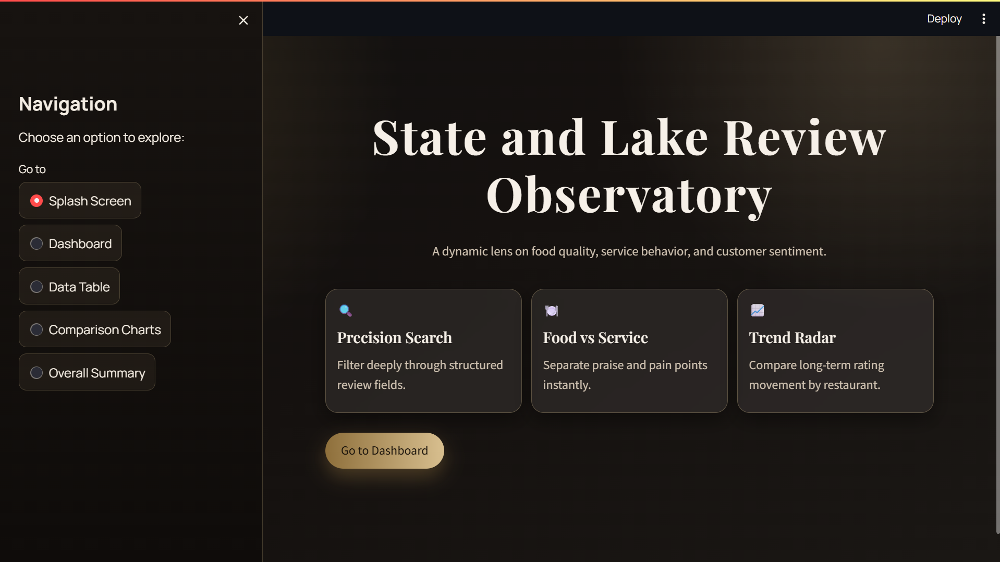
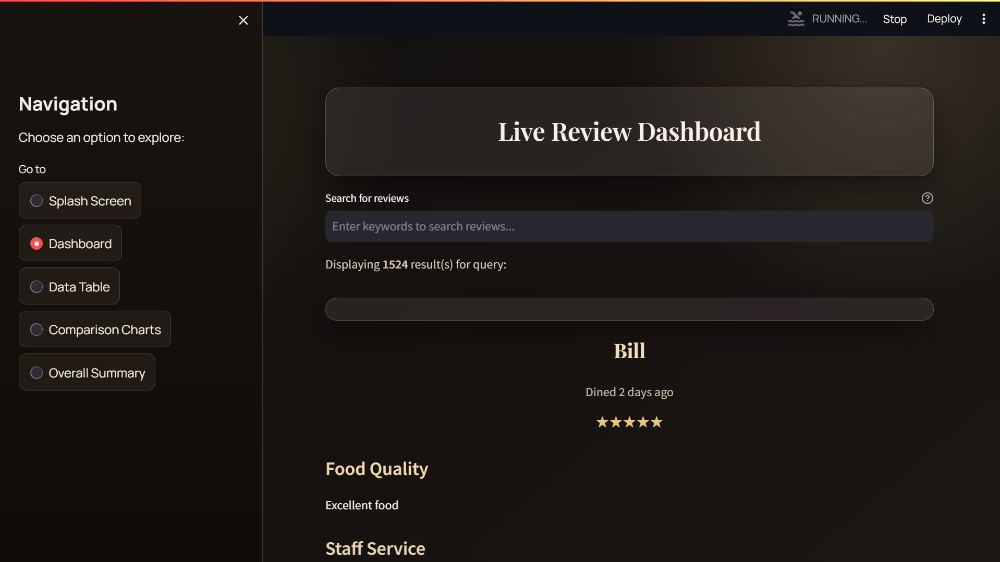
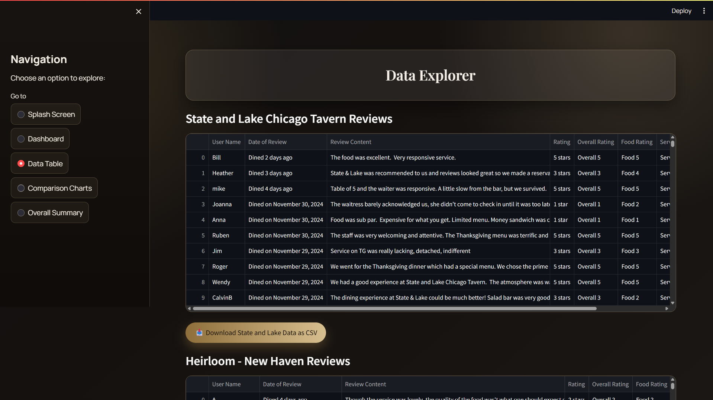
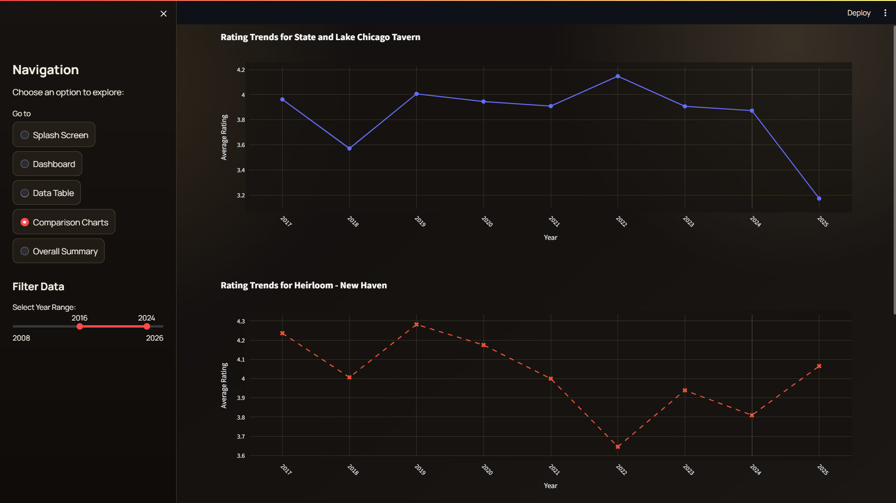
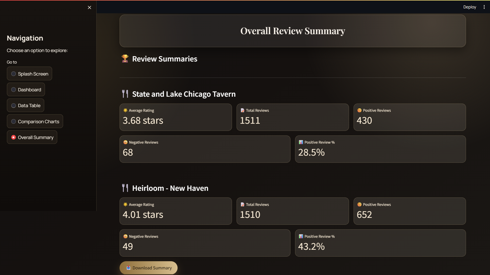
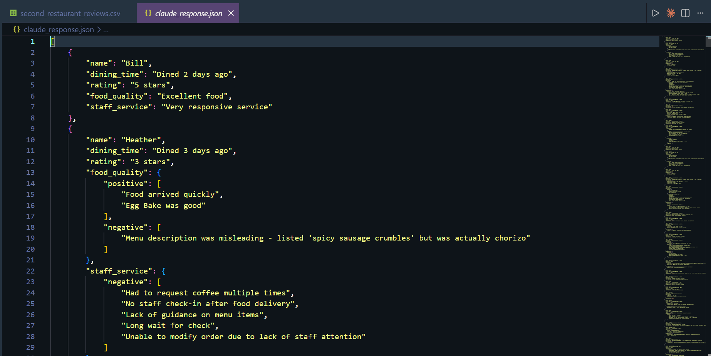
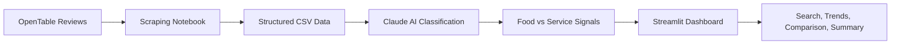
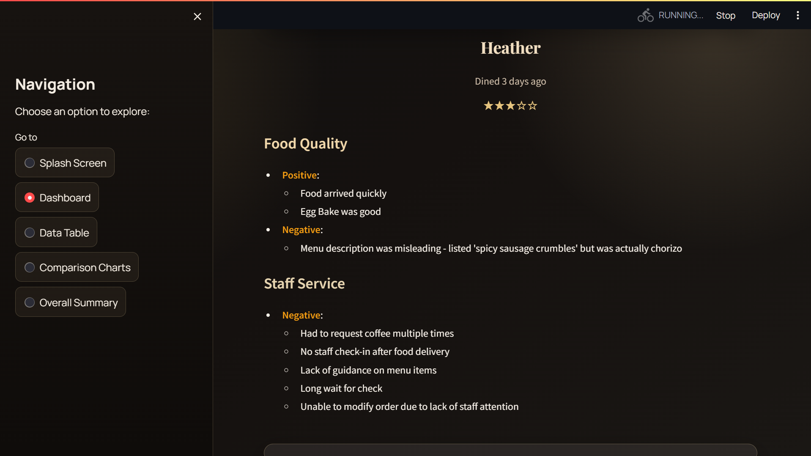
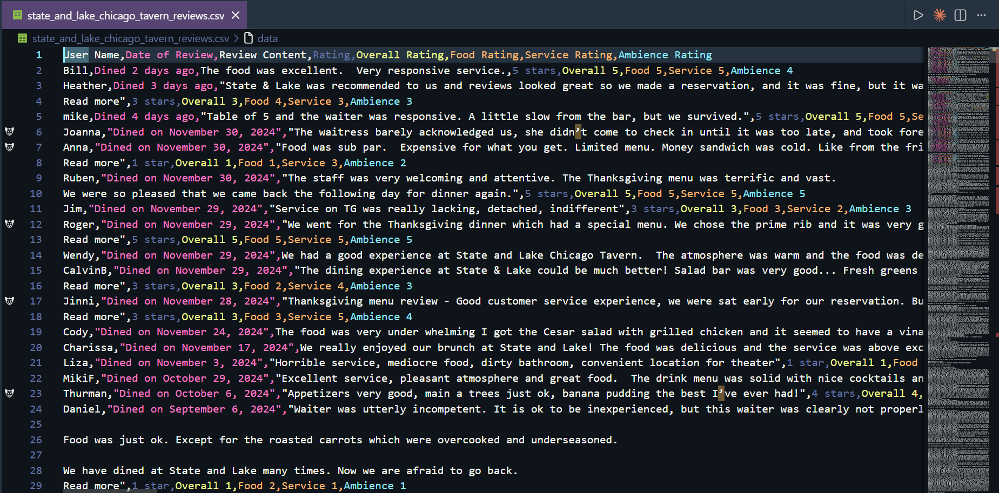
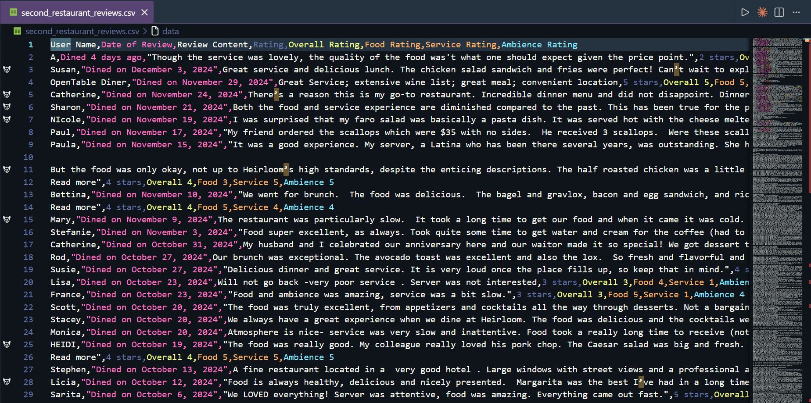

<div align="center">

# AI-Powered Restaurant Review Intelligence

### Turn raw dining feedback into visual, actionable insight.

<p>
   
   
   
   
</p>

<p>
   A visually rich Streamlit dashboard for scraping, structuring, and analyzing restaurant reviews with an emphasis on <strong>food quality</strong>, <strong>staff service</strong>, and <strong>competitor comparison</strong>.
</p>

</div>



## Why This Project Stands Out

This project is not just a review viewer. It is a full review intelligence workflow that turns unstructured customer commentary into an interface decision-makers can actually use.

| What it does                                    | Why it matters                                                                     |
| ----------------------------------------------- | ---------------------------------------------------------------------------------- |
| Separates food vs. service sentiment            | Helps teams identify whether the kitchen or front-of-house is driving satisfaction |
| Compares two restaurants over time              | Makes competitive context visible instead of relying on isolated ratings           |
| Offers searchable structured review exploration | Lets users move from high-level trends to individual customer comments quickly     |
| Presents everything in a polished dashboard     | Makes the analysis feel like a product, not a notebook dump                        |

## Experience Preview

<table>
   <tr>
      <td></td>
      <td></td>
   </tr>
   <tr>
      <td></td>
      <td></td>
   </tr>
   <tr>
      <td></td>
      <td></td>
   </tr>
</table>

## Review Intelligence Pipeline



## Core Features

### Intelligent Review Analysis

- Extracts reviews from OpenTable using Selenium, Requests, and BeautifulSoup.
- Processes reviews with Claude-generated structured output stored in `claude_response.json`.
- Splits customer feedback into food quality, staff service, and other comments.

### Interactive Dashboard Views

- Splash screen with a branded landing experience.
- Review dashboard with keyword search across structured review data.
- Data explorer for raw CSV inspection and download.
- Comparison charts for long-term restaurant rating trends.
- Overall summary cards for KPI-style restaurant snapshots.

### Fast Comparative Insight

- Compares State and Lake Chicago Tavern with a second restaurant dataset.
- Surfaces yearly rating movement, positive review counts, and negative review counts.
- Helps identify whether performance differences are isolated or systemic.

## Project Showcase

> Current sample analysis focuses on **State and Lake Chicago Tavern** and compares it against **Heirloom - New Haven** to highlight differences in customer perception, review volume, and rating trajectory.

| Screen                       | Snapshot                                                                                   |
| ---------------------------- | ------------------------------------------------------------------------------------------ |
| Structured review explorer   |                            |
| Scraped review source sample |  |
| Competitor source sample     |  |

## Tech Stack

| Layer         | Tools                                 |
| ------------- | ------------------------------------- |
| Dashboard     | Streamlit, Plotly                     |
| Data handling | Pandas, JSON, CSV                     |
| Scraping      | Selenium, BeautifulSoup, Requests     |
| Analysis      | Claude-assisted review categorization |
| Workflow      | Jupyter Notebook + Python app         |

## Repository Layout

| File                                        | Purpose                                           |
| ------------------------------------------- | ------------------------------------------------- |
| `dashboard.py`                              | Main Streamlit application entry point            |
| `semester_project.ipynb`                    | Scraping and preprocessing workflow               |
| `claude_response.json`                      | AI-structured review output used by the dashboard |
| `state_and_lake_chicago_tavern_reviews.csv` | Primary restaurant review dataset                 |
| `second_restaurant_reviews.csv`             | Comparison restaurant dataset                     |
| `restraunt_review_analyzer/`                | Screenshot assets used for documentation          |

## Quick Start

### 1. Install dependencies

```bash
pip install streamlit pandas plotly selenium beautifulsoup4 requests matplotlib
```

### 2. Launch the dashboard

```bash
streamlit run dashboard.py
```

### 3. Explore the app

- Open the splash screen for the landing overview.
- Search structured reviews inside the dashboard tab.
- Inspect CSVs inside the data table view.
- Compare trends in the comparison charts view.
- Review KPIs in the overall summary section.

## Data Inputs

The dashboard currently expects these local inputs to be present in the project root:

- `claude_response.json`
- `state_and_lake_chicago_tavern_reviews.csv`
- `second_restaurant_reviews.csv`

If you want to collect fresh reviews, use the notebook workflow in `semester_project.ipynb`, update the target restaurant URL, and regenerate the downstream data files.

## Use Cases

- Restaurant owners tracking recurring praise and complaints.
- Operations teams separating kitchen issues from service issues.
- Analysts comparing one venue against a competitor over time.
- Portfolio teams building a repeatable restaurant intelligence workflow.

## Closing Note

This repository demonstrates how review scraping, AI-assisted classification, and dashboard design can combine into a cleaner decision-support tool for hospitality analysis.
